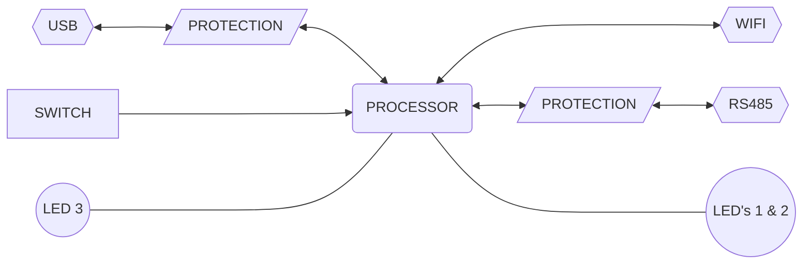

  

# interfaceNode
## _Datasheet_

The Atkin Engineering _**interfaceNode**_ is a Wireless RS-485 bridge that provides a bridging connections between RS-485, WiFi and USB for various control devices.

|             _**front**_             |             _**rear**_             |
| :---------------------------------: | :--------------------------------: |
|  |  |

## Block Diagram

## Specifications
Due to continuous improvements and innovations, specifications may change without notice.

### Mechanical
- Dimensions 120 x 50 x 30 mm (4.72 x 2.36 x 1.18 in)
- Weight 105 grams (2.71 oz)

### Electrical
- Supply: 12/24 VDC (absolute range 5 - 42 VDC) from RJ45 port
- Supply: 20-250ma @ 12 VDC [^current]   

## Protections
### Power
- AEC-Q100 Qualified
- Reverse Input Protection to –40 VDC

### RS485 Data
- IEC 61000-4-2 electrostatic discharge (ESD), Level 4 - 8k V / 15 kV (Contact / Air)
- IEC 61000-4-4 electrical fast transients (EFT), Level 4 - 2 kV
- IEC 61000-4-5 surge immunity, Level 2 - 4 kV
- ±70 VDC bus fault

###  USB
- Isolation voltage 2.5kV
- Transient / Surge 5kV

## Services

### RS485
- Full / Half duplex
- Termination `None` / `120ohm`
- Protocol aware

### WiFi (Access Point / Station)
- 802.11b/g/n - compliant
- Bit rate: 802.11n up to 150 Mbps
- Center frequency range of operating channel: 2412 ~ 2484 MHz

### USB
- USB serial data
  - CDC / RNDIS

### Bluetooth [^bluetooth]
- Bluetooth LE: Bluetooth 5, Bluetooth mesh

## Connections
_**Front**_
- USB Type-C, USB 2.0 full-speed port [^usbpower] 
- 1x RGB status LED
- 1x Service switch

_**Rear**_
- 2x RS-485 (parallel RJ12 6P6 ports) [^rs485power]
- 2x RGB status LED’s

## Environment
- Operating Temperature: 5° to 40°C ambient (41° to 104°F)
- Storage/Transport Temperature -20° to 65°C ambient (-4° to 149°F)
- Humidity 0 to 90% non-condensing

## Compliance
- RF certification: CE, FCC, IC, SRRC, TELEC & BQB
- Green certification: REACH/RoHS

## Supplied accessories
- 1x USB Type-C to USB Type-A cable
- 1x RJ12 cable

_**© Atkin Engineering. All rights reserved.**_ [^copyright]

---
[^current]: Current requirements dependant on operating modes and environment.  
[^usbpower]: USB Type-C port does not supply power.  
[^rs485power]: RS-485 (parallel RJ12 6P6 ports) supplies power to _**interfaceNode**_.  
[^bluetooth]: Bluetooth functionality is under development and are subject to change.   
[^copyright]: _**© Atkin Engineering. All rights reserved.**_ Specifications are subject to change without notice. No representation or warranty as to the accuracy or completeness of the information included herein is given and any liability for any action in reliance thereon is disclaimed.  
